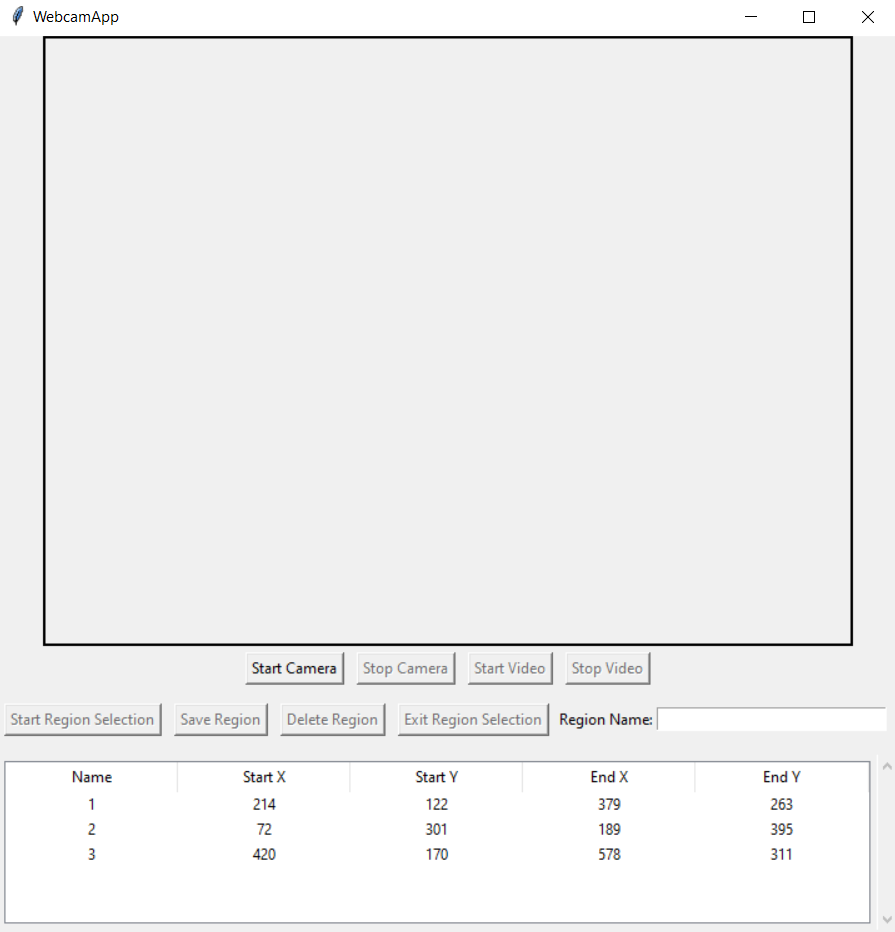
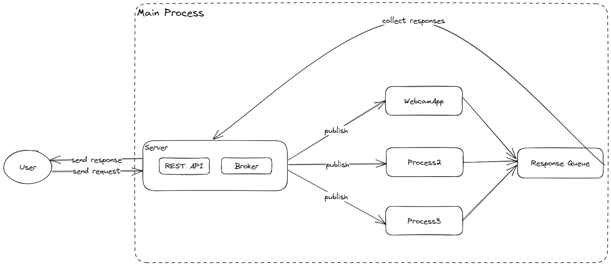

# Lazypilot


## Quick Start
1. clone project
```sh
git clone https://github.com/maple24/lazypilot.git
```
2. create python virtual environment
```sh
cd lazypilot
python -m venv .venv
```
3. activate venv and install dependencies
```sh
.venv/scripts/activate
pip install -r requirements.txt
```
4. run
```sh
python main.py
```

## Architecture

- zeroMQ to publish message to processes with [topic, message]
- multiprocessing queue to get response back
- fastapi to provide restapi interface

## Test
curl -X POST -H "Content-Type: application/json" -d '{"message": "helloworld"}' http://localhost:1234/test/

curl -X GET http://localhost:1234/

curl -X POST -H "Content-Type: application/json" -d '{"topic": "webcam", "action": {"method": "compare", "params": {"method": "compare", "params": {"name": ""}}}}' http://localhost:8000/update_message/

curl -X POST http://localhost:1234/publish/YourMessageHere